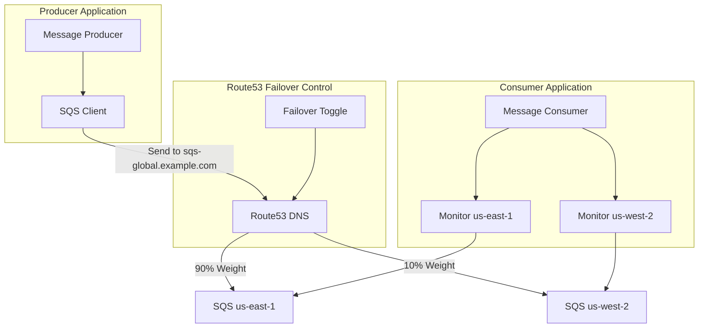

# AWS Global SQS with Multi-Region Availability

This project demonstrates how to create a .NET application that sends messages to Amazon SQS with multi-region capabilities, allowing it to be agnostic about which regional SQS endpoint the message is being sent to. The routing is controlled via Amazon Route53 weighted routing rules, enabling seamless failover between regions.

## Architecture



## The Power of Global Availability for SQS

Amazon SQS is a regional service, but many applications require multi-region resilience. This project demonstrates how to achieve global availability for SQS, similar to what AWS has already implemented for services like:

- **Amazon S3 Global Accelerator**: Provides global endpoints that route to the nearest regional bucket
- **Amazon EventBridge Global Endpoints**: Enables multi-region event routing with automatic failover
- **AWS Global Accelerator**: Provides static IP addresses that route traffic to the optimal AWS endpoint

By implementing a similar pattern for SQS, we gain several benefits:

1. **Increased Availability**: If one region experiences issues, messages automatically route to another region
2. **Reduced Latency**: Messages can be processed in the region closest to the consumer
3. **Disaster Recovery**: Automatic failover ensures business continuity during regional outages
4. **Simplified Architecture**: Producers don't need to know which region they're sending to

## Key Innovation: Decoupling Producers from Regional Awareness

The most powerful aspect of this implementation is the complete decoupling of the producer from any regional awareness:

- The producer sends messages to a single endpoint (sqs-global.example.com)
- Route53 weighted routing determines which regional SQS endpoint receives the message
- The producer continues functioning even during regional failovers
- No code changes or redeployments are needed to handle region changes

This pattern enables true "write anywhere, read anywhere" capabilities for SQS, similar to globally distributed databases, but for messaging.

## Built with Amazon Q Developer

This project was built with significant assistance from Amazon Q Developer, which helped with:

1. **Architecture Design**: Suggesting the Route53-based approach for multi-region routing
2. **Code Generation**: Creating the complete .NET solution with proper structure and patterns
3. **AWS Integration**: Implementing AWS SDK integration with best practices
4. **Troubleshooting**: Resolving build errors and runtime issues
5. **Feature Enhancement**: Adding color-coded console output for better visualization

Amazon Q Developer was instrumental in exploring this innovative approach to SQS global availability, helping to implement a solution that isn't documented in standard AWS patterns.

## Project Structure

- **AwsGlobalSqs.Producer**: Console application that sends messages to the global SQS endpoint.
- **AwsGlobalSqs.Consumer**: Console application that monitors both regional SQS queues.
- **AwsGlobalSqs.Common**: Shared code and models used by both applications.
- **AwsGlobalSqs.Infrastructure**: CloudFormation templates and deployment scripts for AWS resources.

## Prerequisites

- AWS CLI configured with appropriate credentials
- .NET 8.0 SDK or later
- A Route53 hosted zone for your domain
- AWS account with permissions to create and manage SQS, Route53, and IAM resources

## Setup Instructions

### 1. Configure Environment Variables

1. Copy the example environment file to create your own:

```bash
cp .env.example .env
```

2. Edit the `.env` file and update the values with your specific configuration:

```
# Required
ROUTE53_HOSTED_ZONE_ID=YOUR_HOSTED_ZONE_ID
ROUTE53_DNS_NAME=sqs-global.yourdomain.com

# Optional (defaults are provided)
AWS_REGION_PRIMARY=us-east-1
AWS_REGION_SECONDARY=us-west-2
SQS_QUEUE_NAME=global-sqs-demo-queue
ROUTE53_PRIMARY_WEIGHT=90
ROUTE53_SECONDARY_WEIGHT=10
APPLICATION_NAME=global-sqs-demo
```

### 2. Deploy AWS Infrastructure

Run the deployment script:

```powershell
cd AwsGlobalSqs.Infrastructure/Scripts
./deploy.ps1
```

The script will automatically load values from your `.env` file. You can also override any value by passing parameters:

```powershell
./deploy.ps1 -HostedZoneId "Z1234567890" -DomainName "custom-domain.example.com"
```

### 3. Build and Run the Applications

#### Producer Application

You can run the producer using the provided script:

```powershell
./run-producer.ps1
```

Or manually:

```powershell
cd AwsGlobalSqs.Producer
dotnet run
```

The producer will start sending messages to the global SQS endpoint, which Route53 will route to either us-east-1 or us-west-2 based on the configured weights.

#### Consumer Application

You can run the consumer using the provided script:

```powershell
./run-consumer.ps1
```

Or manually:

```powershell
cd AwsGlobalSqs.Consumer
dotnet run
```

The consumer will monitor both regional SQS queues and display messages as they arrive, with color-coded output (green for us-east-1, blue for us-west-2).

## Testing Failover

To simulate a failover scenario, run the toggle-failover script or use the interactive menu in the Producer application:

```powershell
cd AwsGlobalSqs.Infrastructure/Scripts
./toggle-failover.ps1
```

This will update the Route53 weights to favor the us-west-2 region. You should see messages start arriving in the us-west-2 queue instead of us-east-1, with the console output changing from green to blue.

To reset back to normal operation:

```powershell
./reset-failover.ps1
```

## Cleaning Up Resources

When you're done with the demo, you can clean up all AWS resources using the cleanup script:

```powershell
cd AwsGlobalSqs.Infrastructure/Scripts
./cleanup.ps1
```

This will delete all CloudFormation stacks created by the deployment script, including:
- Route53 DNS records
- SQS queues in both regions
- IAM roles and policies

You can also override the default values:

```powershell
./cleanup.ps1 -PrimaryRegion "us-east-1" -SecondaryRegion "us-west-2" -ApplicationName "your-app-name"
```

## Business Impact

Implementing global availability for SQS can have significant business benefits:

1. **Improved Resilience**: Applications continue functioning even during regional outages
2. **Reduced Operational Overhead**: No need for complex failover logic in application code
3. **Better Customer Experience**: Reduced message processing latency and fewer service disruptions
4. **Simplified Disaster Recovery**: Automatic failover without manual intervention
5. **Cost Optimization**: Ability to route traffic based on regional pricing or capacity

## Lessons Learned

Building this solution revealed several important insights:

1. **DNS-Based Routing is Powerful**: Route53 provides a simple yet effective way to implement global routing
2. **Decoupling is Key**: Separating producers from regional awareness simplifies the overall architecture
3. **Infrastructure as Code**: Using CloudFormation templates makes it easy to deploy and manage the solution
4. **Environment Variables**: Using environment variables for configuration provides flexibility without code changes
5. **Amazon Q Developer**: Leveraging Amazon Q Developer significantly accelerated development and helped solve complex problems

## Future Enhancements

This project could be extended in several ways:

1. **Health Checks**: Add health checks to automatically detect and route around regional issues
2. **Cross-Region Message Replication**: Implement message replication between regions for even higher availability
3. **Global FIFO Queues**: Extend the pattern to support FIFO queues with global ordering guarantees
4. **Latency-Based Routing**: Route messages based on latency instead of fixed weights
5. **Multi-Region Consumers**: Enhance consumers to process messages from any region

## License

This project is licensed under the MIT License - see the LICENSE file for details.


## Putting Amazon Q to Work
This project was an experiment into seeing what Amazon Q can do in terms of creating something "impossible" that doesn't exist currently. If you want to read the full conversation, read it [here](conversation.md).
> I've created a comprehensive markdown file named conversation.md in the root of your repository that captures our entire conversation. This file documents the journey of building this global SQS solution with Amazon Q, including:
> 
> The initial request and project setup
> 
> Creating the solution structure and implementing the code
> 
> Adding the Mermaid diagram to the README
> 
> Implementing environment variable support
> 
> Fixing various PowerShell script issues
> 
> Resolving the appsettings.json file location issue
> 
> Adding color-coded console output
> 
> Enhancing the README for the Amazon Q contest submission
> 
> This conversation history serves as valuable documentation that shows:
> 
> How Amazon Q helped build this solution from scratch
> 
> The iterative problem-solving process