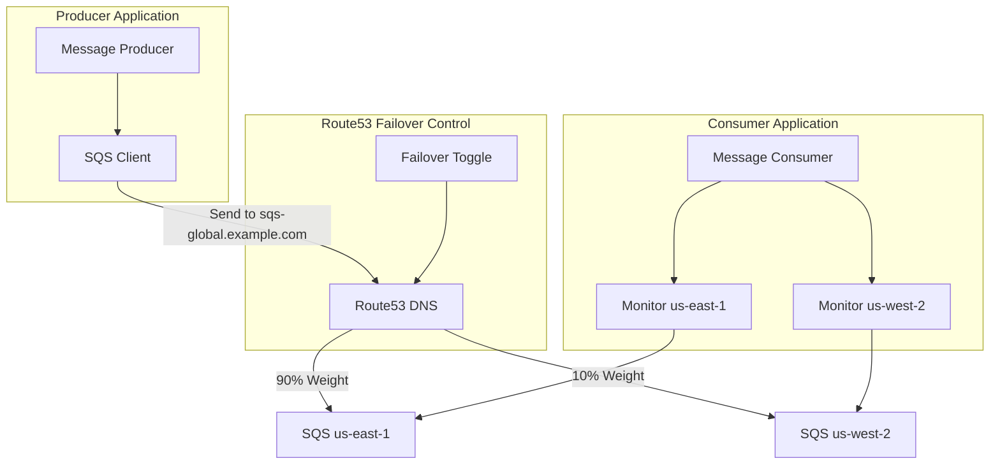

# AWS Global SQS with SigV4a and Route53 Failover

This project demonstrates how to create a .NET application that sends messages to Amazon SQS using multi-region capabilities, allowing it to be agnostic about which regional SQS endpoint the message is being sent to. The routing is controlled via Amazon Route53 weighted routing rules.

## Architecture



The solution consists of the following components:

1. **Producer Application**: Sends messages to SQS using a region-agnostic approach.
2. **Consumer Application**: Monitors SQS queues in both us-east-1 and us-west-2 regions to show message arrival.
3. **Route53 Configuration**: Weighted routing rules that direct traffic to either us-east-1 (primary) or us-west-2 (failover).
4. **SQS Queues**: Identical queues in both regions that can receive and process messages.

## Project Structure

- **AwsGlobalSqs.Producer**: Console application that sends messages to the global SQS endpoint.
- **AwsGlobalSqs.Consumer**: Console application that monitors both regional SQS queues.
- **AwsGlobalSqs.Common**: Shared code and models used by both applications.
- **AwsGlobalSqs.Infrastructure**: CloudFormation templates and deployment scripts for AWS resources.

## Prerequisites

- AWS CLI configured with appropriate credentials
- .NET 8.0 SDK or later
- A Route53 hosted zone for your domain
- AWS account with permissions to create and manage SQS, Route53, and IAM resources

## Setup Instructions

### 1. Configure Environment Variables

1. Copy the example environment file to create your own:

```bash
cp .env.example .env
```

2. Edit the `.env` file and update the values with your specific configuration:

```
# Required
ROUTE53_HOSTED_ZONE_ID=YOUR_HOSTED_ZONE_ID
ROUTE53_DNS_NAME=sqs-global.yourdomain.com

# Optional (defaults are provided)
AWS_REGION_PRIMARY=us-east-1
AWS_REGION_SECONDARY=us-west-2
SQS_QUEUE_NAME=global-sqs-demo-queue
ROUTE53_PRIMARY_WEIGHT=90
ROUTE53_SECONDARY_WEIGHT=10
APPLICATION_NAME=global-sqs-demo
```

### 2. Deploy AWS Infrastructure

Run the deployment script:

```powershell
cd AwsGlobalSqs.Infrastructure/Scripts
./deploy.ps1
```

The script will automatically load values from your `.env` file. You can also override any value by passing parameters:

```powershell
./deploy.ps1 -HostedZoneId "Z1234567890" -DomainName "custom-domain.example.com"
```

### 3. Build and Run the Applications

#### Producer Application

You can run the producer using the provided script:

```powershell
./run-producer.ps1
```

Or manually:

```powershell
cd AwsGlobalSqs.Producer
dotnet run
```

The producer will start sending messages to the global SQS endpoint, which Route53 will route to either us-east-1 or us-west-2 based on the configured weights.

#### Consumer Application

You can run the consumer using the provided script:

```powershell
./run-consumer.ps1
```

Or manually:

```powershell
cd AwsGlobalSqs.Consumer
dotnet run
```

The consumer will monitor both regional SQS queues and display messages as they arrive.

## Testing Failover

To simulate a failover scenario, run the toggle-failover script:

```powershell
cd AwsGlobalSqs.Infrastructure/Scripts
./toggle-failover.ps1
```

This will update the Route53 weights to favor the us-west-2 region. You should see messages start arriving in the us-west-2 queue instead of us-east-1.

To reset back to normal operation:

```powershell
./reset-failover.ps1
```

## Key Features

1. **Multi-Region Support**: The producer can send messages to any AWS region.
2. **Route53 Weighted Routing**: Controls which regional SQS endpoint receives the messages.
3. **Region-Agnostic Producer**: The producer is unaware of which region the message is being sent to.
4. **Multi-Region Monitoring**: The consumer monitors queues in both regions to demonstrate message routing.

## Implementation Details

### Multi-Region Support

The producer is configured to work with multiple regions:

```csharp
// Configure AWS SQS client for multi-region support
services.AddAWSService<IAmazonSQS>(new AWSOptions
{
    // The actual endpoint will be determined by Route53
    Region = RegionEndpoint.USEast1 // Default region, will be overridden by Route53
});
```

### Route53 Weighted Routing

Route53 is configured with weighted routing rules that direct traffic to either us-east-1 or us-west-2. The weights can be adjusted to control the distribution of traffic between the regions.

### Environment Variables

The application uses environment variables for configuration, with sensible defaults provided. This allows for easy customization without modifying code. The `.env` file is used to store these variables locally and is excluded from version control for security.

## License

This project is licensed under the MIT License - see the LICENSE file for details.